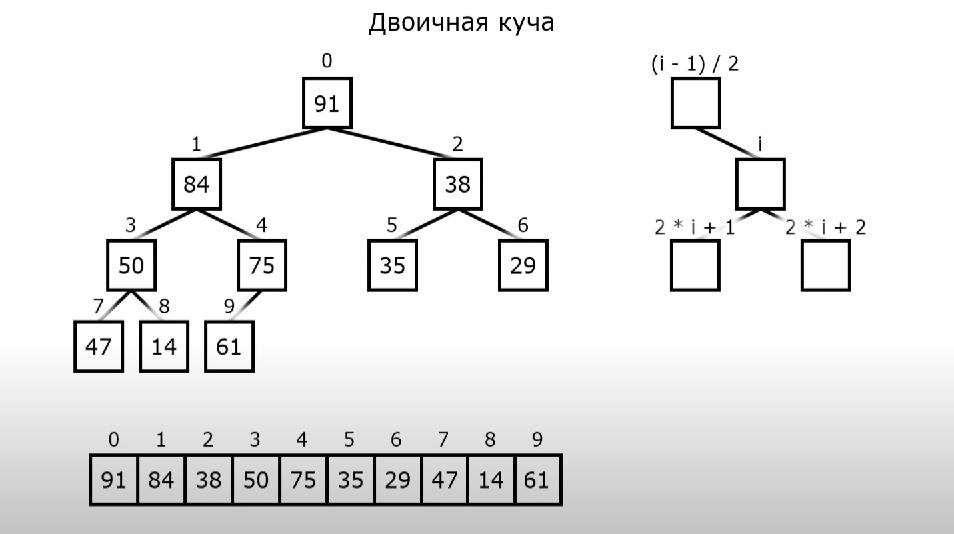

1. Базовые определения и термины.  

* Пусть ```v1, v2``` — вершины, ```e = (v1, v2)``` — соединяющее их ребро. Тогда вершина ```v1``` и ребро ```e``` **инцидентны**, ребро ```e``` и вершина ```v2``` также инцидентны. Два ребра, инцидентные од
ной вершине, называются **смежными**; две вершины, инцидентные одному ребру, также называются **смежными**.

* Количество рёбер, инцидентных вершине ```v```, называется **степенью** (или **валентностью**)
вершины ```v``` и обозначается ```d(v)```

* Последовательность степеней вершин (d1,...,dp) некоторого графа называется **степенной последовательностью графа** или **графовой последовательностью**.

* Не всякая последовательность неотрицательных целых чисел является степенной после
довательностью.  
**Пример**. Последовательность ```(0,1,2,...,p − 1)``` не является степенной ни при каком
```p > 1```. Действительно, первая вершина должна быть изолированной, а последняя должна быть смежна со всеми остальными, что противоречит изолированности первой вершины.

* Пусть ```D = (d1,...,dp)``` — неубывающая последовательность натуральных чисел, причём ```∀i (di < p)```. Построим последовательность ```D′ = (d′1,...,d′p−1)``` следующим образом:  
```d′p−1 := dp−1 − 1, ..., d′p−dp+1 := dp−dp+1 − 1```,  
```d′p−dp := dp−dp − 1, d′p−dp−1 := dp−dp−1, ..., d′1 := d1```.  
*Другими словами*, последний (наибольший) элемент последовательности D удаляется, а ```dp``` предшествующих элементов уменьшаются на единицу. Оставшиеся вершины (они есть, если ```dp < p−1```) остаются без изменения.  
Такая операция называется **откладыванием** вершины ```dp```, а ```D′``` называется остаточной последовательностью.  
**Пример**. Пусть  
```D = (1, 1, 1, 1, 1, 1, 3, 4)```, тогда  
```D′ = (1, 1, 1, 0, 0, 0, 2)```

* **Теорема**. Последовательность ```D = (d1,...,dp)``` является степенной последовательностью тогда и только тогда, когда последовательность ```D′ = (d′1,...,d′p−1)```, полученная откладыванием последнего элемента ```dp```, является степенной.

2. Построение графа.  

* В качестве примера использования двоичной кучи рассмотрим задачу построения графа по заданным степеням вершин, <u>если такой граф существует</u>. Для решения этой задачи подходит структура данных **очередь с приоритетом**, реализуемая на основе двоичной кучи.

* 

* *Весьма иронично, учитывая, что в прошлой лабораторной я не додумался до данной структуры данных*

* **Замечание**. Для заданной последовательности чисел граф существует не всегда. Если вершину наибольшей степени не удаётся отложить, то граф построить невозможно.
